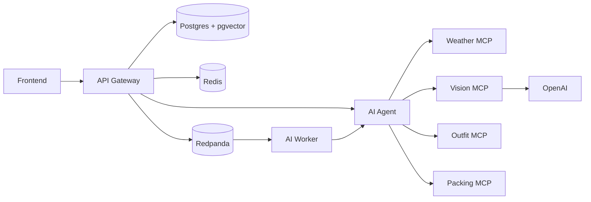

# ClozeHive

ClozeHive is a wardrobe intelligence app with a React frontend, a FastAPI API
gateway, LangGraph-based AI orchestration, Kafka-backed async processing, and
small MCP services for weather, vision, outfit, and packing tools.

The local folder may still be named `closetiq-integrated`; `ClozeHive` is the
product/repository name used in documentation.

## Architecture



## Service Responsibilities

- `frontend`: React + Vite app served on host port `3001` in Docker.
- `services/api-gateway`: public FastAPI boundary, auth, closet APIs, database access, Redis cache, and Kafka event production.
- `services/ai-agent`: FastAPI + LangGraph orchestration over MCP tools and vector retrieval.
- `services/ai-worker`: async Kafka consumer for background AI request processing.
- `services/mcp`: independent MCP tool services for weather, vision, outfit suggestions, and packing.
- `infra`: local infrastructure configuration for Postgres, Redpanda/Kafka, and Nginx.

Legacy stacks are archived under `archive/legacy-2026-04-28`. Duplicate cleanup
copies are archived under `archive/legacy-2026-04-28-repo-cleanup`.

## Local Setup With Docker

1. Copy the environment template and fill in secrets:

   ```sh
   cp .env.example .env
   ```

2. Start the stack:

   ```sh
   make up
   ```

3. Check health:

   ```sh
   make health
   ```

Useful URLs:

- Frontend: `http://localhost:3001`
- API gateway: `http://localhost:8000/health`, `/live`, `/ready`
- AI agent health: `http://localhost:8001/health`
- Redpanda Console: `http://localhost:8080`

## Local Setup Without Docker

Start Postgres, Redis, and Redpanda first, then install local dependencies:

```sh
npm install
npm --prefix frontend install
python3 -m venv .venv
. .venv/bin/activate
pip install -r services/api-gateway/requirements-dev.txt
pip install -r services/ai-agent/requirements.txt
```

Run app services in separate terminals:

```sh
npm run dev:api
npm run dev:agent
npm run dev:frontend
```

## Environment Variables

Use `.env.example` as the source of truth for local values. The most commonly
changed settings are:

- `OPENAI_API_KEY`: required for vision and AI agent flows.
- `JWT_SECRET`: replace the development value before sharing an environment.
- `DATABASE_URL`: host development defaults to Postgres on port `5433`.
- `REDIS_URL`: host development defaults to Redis on port `6380`.
- `KAFKA_BOOTSTRAP_SERVERS`: use `redpanda:9092` inside Docker and `localhost:19092` from the host.
- `ALLOWED_ORIGINS`: include the frontend origins used by Docker and Vite.

Never commit a real `.env` file.

## Common Commands

```sh
make help             # list Makefile commands
make up               # build and start Docker services
make stop             # stop services without removing volumes
make down             # stop services and remove volumes
make logs             # follow all Compose logs
make migrate          # run Alembic migrations
make test-api         # run API tests with local Python deps
make build-frontend   # type-check and build the frontend
make smoke            # validate Compose config and health endpoints
make clean            # remove generated artifacts and caches
```

## Verification

Run these before handing off changes:

```sh
docker compose config --quiet
make smoke
make build-frontend
```

### Dependency audits

```sh
npm audit --prefix frontend
pip install pip-audit && pip-audit -r services/api-gateway/requirements.txt
```

### API health endpoints

- `GET /live` — process is up (Docker liveness)
- `GET /ready` — database and Redis (when `REDIS_CHECK_ON_READY=true`)
- `GET /health` — aggregate JSON status for operators

For API tests, install dev dependencies locally or run them in a disposable
container with a writable dependency location:

```sh
cd services/api-gateway
python -m pytest tests/ -v --tb=short
```

## Troubleshooting

- Missing OpenAI features: confirm `OPENAI_API_KEY` is set in `.env`, then restart `ai-agent` and `mcp-vision`.
- Redpanda startup issues: run `docker compose ps` and check `docker compose logs redpanda kafka-topics`.
- API cannot reach AI agent: confirm `AI_AGENT_URL` is `http://ai-agent:8001` inside Docker.
- Frontend cannot reach API: confirm `VITE_API_URL` points to `http://localhost:8000` for browser-based local development.
- Stale generated files: run `make clean`, then rebuild only what you need.