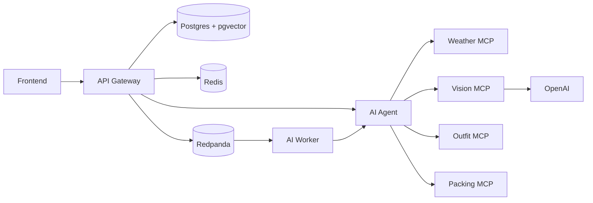

# ClozeHive

ClozeHive is a wardrobe intelligence app: digital closet, outfit building, travel
and packing ideas, analytics, and an AI stylist backed by your own items. The
stack is a **React + Vite** frontend, a **FastAPI** API gateway (auth, closet,
embeddings, outfits, trips, analytics, smart ingest), **LangGraph**-style AI
orchestration in the **ai-agent** service, optional **Kafka / Redpanda** for
async AI jobs via **ai-worker**, and small **MCP** tool services (weather,
vision, outfit, packing) that can still be run under a Docker profile for
legacy setups.

**Repository:** [github.com/phanidhar09/clozehive](https://github.com/phanidhar09/clozehive)

The local folder may still be named `closetiq-integrated`; **ClozeHive** is the
product name used in docs and env templates.

## Architecture



Much of the weather / vision / outfit / packing logic can also run **inside the
API gateway** as Python services; the standalone MCP containers are optional
(see Docker Compose `legacy-mcp` profile).

## Service responsibilities

| Area | Role |
|------|------|
| `frontend` | React app; Vite dev server or static build. In **Docker**, host port defaults to **3001** → container **3000** (`FRONTEND_HOST_PORT`). |
| `services/api-gateway` | Public API: JWT + Google OAuth, closet CRUD, vector search, outfits, trips, analytics, health, rate limiting, security headers, Kafka producers, optional Firestore paths. |
| `services/ai-agent` | FastAPI + agent orchestration, MCP tools, pgvector retrieval. |
| `services/ai-worker` | Kafka consumer for background AI request handling. |
| `services/mcp/*` | Optional MCP microservices (weather, vision, outfit, packing). |
| `nginx/` | Reverse proxy / TLS-oriented config for production-style hosting. |
| `infra/` | Postgres init, Kafka topic scripts, local infra glue. |

Legacy stacks, if present, live under `archive/`.

## Local setup with Docker

1. Copy the environment template and fill in secrets:

   ```sh
   cp .env.example .env
   ```

   For frontend-only overrides (e.g. `VITE_API_URL`, feature flags), you can use
   `frontend/.env.example` → `frontend/.env`.

2. Start the stack:

   ```sh
   make up
   ```

   Or: `docker compose up --build` (add `-d` to detach).

3. Run migrations (if the `migrate` service has not already applied them):

   ```sh
   make migrate
   ```

4. Check health:

   ```sh
   make health
   ```

### Useful URLs (default Docker / local)

| Service | URL |
|---------|-----|
| Frontend | `http://localhost:3001` (override with `FRONTEND_HOST_PORT`) |
| API gateway | `http://localhost:8000` — `/health`, `/live`, `/ready` |
| OpenAPI docs | `http://localhost:8000/docs` |
| AI agent | `http://localhost:8001/health` |
| Redpanda Console | `http://localhost:8080` |

**Port note:** `.env.example` uses `FRONTEND_PORT=3000` and `VITE_API_URL` for
**host-side** Vite dev; the **Compose** frontend mapping defaults to **3001** on
the host so it does not clash with other tools. Align `VITE_API_URL` and
`ALLOWED_ORIGINS` with whichever origin you actually use.

### Optional legacy MCP stack

Standalone MCP containers are behind the `legacy-mcp` profile:

```sh
docker compose --profile legacy-mcp up -d
```

## Production-oriented compose

For a slimmer deployment (nginx, API gateway, Postgres, Redis, Certbot-oriented
pieces), see `docker-compose.prod.yml` and `nginx/nginx.conf`. Adjust env vars
for your provider; helper scripts live under `scripts/` (e.g. deploy, backup,
restore, LetsEncrypt init). Production compose disables Kafka by default
(`KAFKA_ENABLED: "false"` in that file)—enable and wire brokers if you need
async workers in prod.

## Local setup without Docker

Start Postgres (with pgvector), Redis, and Redpanda, then:

```sh
npm --prefix frontend install
python3 -m venv .venv
source .venv/bin/activate   # Windows: .venv\Scripts\activate
pip install -r services/api-gateway/requirements-dev.txt
pip install -r services/ai-agent/requirements.txt
```

Run services in separate terminals:

```sh
make dev-api        # API gateway :8000
make dev-agent      # AI agent :8001
make dev-frontend   # Vite (see frontend/package.json for port)
```

## Environment variables

Use **`.env.example`** as the source of truth. Commonly customized values:

- **`OPENAI_API_KEY`** — direct stylist chat/streaming, image analysis (vision), and embeddings.
- **`OPENAI_MODEL`** / **`OPENAI_MAX_TOKENS`** — chat and vision model defaults (`gpt-4o`, `1024`).
- **`JWT_SECRET`** — use a long random value; never ship the dev default.
- **`DATABASE_URL`** — host dev often uses Postgres on **`5433`** (see example).
- **`REDIS_URL`** — host dev often uses **`6382`** (Compose default; override with **`REDIS_HOST_PORT`**).
- **`KAFKA_BOOTSTRAP_SERVERS`** — `redpanda:9092` inside Docker, `localhost:19092` from the host.
- **`ALLOWED_ORIGINS`** — must include your real frontend origin(s).
- **Google OAuth** — `GOOGLE_CLIENT_ID`, `GOOGLE_CLIENT_SECRET`, `GOOGLE_REDIRECT_URI`.
- **Frontend** — `VITE_API_URL`, **`VITE_HIDE_NON_MVP`** (toggle non-MVP nav).
- **Optional** — OpenWeather, Sentry, Firebase / Firestore.

Never commit a real `.env` file.

## Common commands

```sh
make help             # list Makefile targets
make up               # build and start Docker services (detached)
make stop             # compose down (keep volumes)
make down             # compose down and remove volumes
make logs             # tail service logs
make migrate          # Alembic via migrate container
make test-api         # pytest in services/api-gateway
make build-frontend   # production build
make smoke            # compose config + health checks
make clean            # clean generated artifacts (see scripts/clean-artifacts.sh)
```

## Verification

```sh
docker compose config --quiet
make smoke
make build-frontend
```

### Dependency audits

```sh
npm audit --prefix frontend
pip install pip-audit && pip-audit -r services/api-gateway/requirements.txt
```

### API health endpoints

- **`GET /live`** — process is up (liveness).
- **`GET /ready`** — DB and Redis when `REDIS_CHECK_ON_READY=true`.
- **`GET /health`** — aggregate JSON for operators.

### Tests

```sh
cd services/api-gateway
python -m pytest tests/ -v --tb=short
```

## Troubleshooting

- **OpenAI errors** — Confirm `OPENAI_API_KEY` in `.env`; restart `ai-agent` (and
  vision MCP if you use it).
- **Redpanda** — `docker compose ps` and `docker compose logs redpanda kafka-topics`.
- **API → AI agent** — In Compose, `AI_AGENT_URL` should be `http://ai-agent:8001`.
- **Browser → API** — `VITE_API_URL` should match reachable host URL (often
  `http://localhost:8000`).
- **CORS** — Ensure `ALLOWED_ORIGINS` includes the exact frontend origin.
- **Stale build output** — `make clean`, then rebuild what you need.
