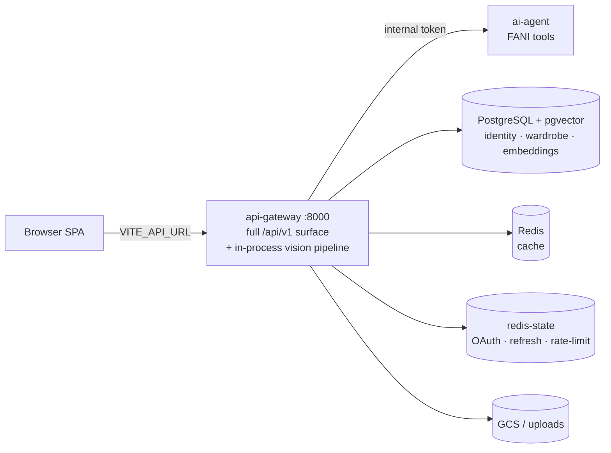
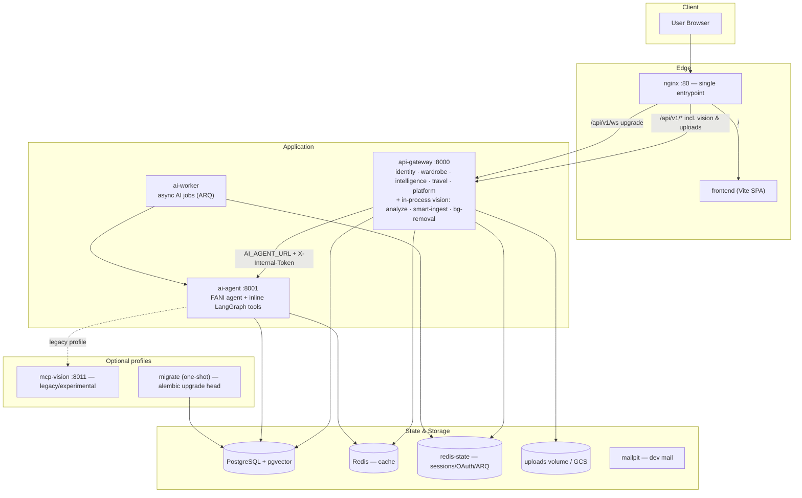

<div align="center">

# ClozeHive

### Wardrobe intelligence, powered by FANI

**A digital closet that thinks** — outfit building, AI styling, travel packing, wear analytics, and RAG-grounded insights built on top of your own items and history.

[**Launch the app →**](https://cloze-hive.onrender.com) &nbsp;•&nbsp; [Marketing site](https://clozehive.netlify.app) &nbsp;•&nbsp; [Repository](https://github.com/phanidhar09/clozehive)


</div>

---

## Table of contents

1. [Overview](#overview)
2. [Meet FANI](#meet-fani)
3. [Feature highlights](#feature-highlights)
4. [Architecture](#architecture)
5. [Core workflows](#core-workflows)
6. [Service responsibilities](#service-responsibilities)
7. [Domain map (api-gateway)](#domain-map-api-gateway)
8. [Technology stack](#technology-stack)
9. [Quick start (Docker)](#quick-start-docker)
10. [Local setup without Docker](#local-setup-without-docker)
11. [Configuration](#configuration)
12. [API surface (v1)](#api-surface-v1)
13. [Testing & quality](#testing--quality)
14. [Operations & health](#operations--health)
15. [Frontend routes](#frontend-routes)
16. [Documentation](#documentation)

---

## Overview

ClozeHive is a **wardrobe intelligence platform**. Users build a digital closet, compose and save outfits, get AI-driven styling and packing help, and track how they actually wear their clothes over time. Every recommendation is grounded in the user's real items and history through a **retrieval-augmented (RAG)** pipeline backed by vector search.

The system is a domain-driven service architecture:

- a **React + Vite + TypeScript** single-page app,
- a **FastAPI** api-gateway that owns the full product API — identity, wardrobe, intelligence, travel, and platform domains — and runs the **image-analysis / background-removal vision pipeline in-process**,
- a dedicated **FANI ai-agent** (LangGraph ReAct + inline tools) the gateway calls for chat, outfit, and packing reasoning,
- an optional **ai-worker** for durable async AI jobs (local dev only),
- **PostgreSQL + pgvector** as the single source of truth and embedding store, **Redis** for cache and session/OAuth state, and
- **nginx** as the single browser entrypoint in the local Docker topology.

> Full environment, migration, GCP, and deployment detail lives in **[docs/ENVIRONMENT.md](docs/ENVIRONMENT.md)**, **[docs/SERVICES.md](docs/SERVICES.md)**, and **[docs/RUNBOOK.md](docs/RUNBOOK.md)**. AI agents should read **[AGENTS.md](AGENTS.md)** for the operational contract.

---

## Meet FANI

**FANI — Fashion AI Nurturing Individuality** — is ClozeHive's built-in AI stylist. FANI powers outfit recommendations, the daily Tip of the Day, wardrobe-gap detection, conversational styling, travel packing, and **Shop with FANI** purchase advice.

The primary stylist experience is the full-screen chat at **`/ai-stylist`** (persisted sessions, structured outfit cards, closet context). The dashboard surfaces FANI nudges and Tip of the Day.

Outfit suggestions carry a **5-tier FANI rating** — Needs Improvement → Average → Good → Excellent → Best Fit — each with a star count, a color badge, and a short stylist note.

---

## Feature highlights

| Area | What you get |
|------|--------------|
| **Home** | Daily FANI Tip of the Day (day-of-week rotation), Style at a Glance (Most Worn / Never Worn / Closet Gaps), quick-action grid, and Outfit of the Day with a 5-tier FANI rating. |
| **Style onboarding** | Guided style-profile flow (`/onboarding/style-profile`) that feeds FANI personalization and RAG context. |
| **Closet** | Full item CRUD with rich metadata, image storage (local disk or GCS), preview/confirm upload flows, **similar-item** search, availability flags, and AI background removal. |
| **Closet match** | Find items in your closet that pair with a reference piece (`/closet-match`). |
| **Smart ingest** | Upload a photo (incl. HEIC) → detection → background removal → structured item metadata, all in-process in the gateway. Bulk **smart-ingest** sessions for multi-photo review. |
| **Outfits** | Outfit builder, saved looks, outfit history (feeds RAG), and **weekly planner** with weather-aware day plans. |
| **FANI AI Stylist** | Structured stylist chat at `/ai-stylist` with SSE streaming, persisted history, and handoff from dashboard nudges. |
| **Travel** | Trips, weather-aware packing lists, packing-memory APIs, occasion planning, and FANI/agent packing tools. |
| **Shop with FANI** | Upload an in-store photo **or** paste a product URL → closet match, buy/skip verdict, outfit ideas, and optional add-to-closet (SSRF-guarded URL fetch). |
| **Intelligence (RAG)** | Fashion knowledge, closet similarity, purchase-gap detection, and a unified `/rag/*` surface backed by pgvector embeddings. |
| **Analytics** | Wear events (append-only), cost-per-wear, utilization, forgotten gems, and versatility scoring. |
| **Profile & Settings** | Display name, location & weather, FANI preferences, avatar, and privacy; navbar dropdown for Saved Outfits, Closet Insights, and Wardrobe Gaps. |
| **Real-time** | WebSocket notifications at `/api/v1/ws` (toast UI in the app shell). |
| **Auth** | JWT + refresh tokens, **Google OAuth**, and password reset (Mailpit in dev). |

---

## Architecture

ClozeHive runs in **two topologies that share one codebase**. The gateway is the single owner of the wardrobe and intelligence domains and runs the vision pipeline in-process in both.

### Production (Render) — canonical

The frontend calls the gateway directly (`VITE_API_URL`). There is no nginx and no `ai-worker`; the gateway serves the **entire** `/api/v1` surface with `SERVE_MIGRATED_DOMAIN_ROUTES=true`.



### Local development (`docker compose up --build`)

The multi-service stack behind nginx. Vision still runs in-process inside the gateway, matching production.



**Key wiring**

| Flow | How it works |
|------|--------------|
| Browser → API | SPA uses relative `/api/v1`; nginx (local) or the gateway directly (prod) handles all `/api` paths. |
| Auth & app data | The gateway owns auth/session and all core business routes, backed by Postgres + Redis. |
| Real-time | Browser WebSocket connects to `/api/v1/ws`; nginx upgrades and forwards to the gateway hub. |
| FANI chat / outfit / packing | Gateway assembles user + closet + RAG context, then calls **ai-agent** via `intelligence/services/ai_client.py` with an internal token. |
| Vision & embeddings | Detection, background removal, and embedding updates run **in-process** in the gateway (`wardrobe` domain). |
| Shopping check & RAG retrieval | Gateway in-process services + pgvector; no ai-agent hop for the core verdict path. |
| Async AI jobs | `POST /jobs` → ARQ on redis-state → ai-worker → ai-agent (local dev; sync in-process in prod). |
| Shared state | Single Postgres DB for everything; Redis cache + redis-state for OAuth, refresh tokens, rate limits. |

**What runs where**

| Capability | Owner |
|------------|-------|
| Auth, profile, trips, analytics, WebSocket | api-gateway |
| Closet, outfits, planner, vision, embeddings | api-gateway (in-process) |
| FANI chat, outfit generation, packing lists | api-gateway → ai-agent |
| Shop with FANI, purchase gaps, fashion RAG | api-gateway + pgvector |
| LangGraph tools (`weather`, `outfit`, `packing`) | ai-agent |

> **History:** standalone `closet-service` (:8003) and `vision-service` (:8002) were **retired** — the gateway already carried those routers and prod served them in-process. The wardrobe domain and vision pipeline now live only in the api-gateway.

---

## Core workflows

End-to-end paths (see [docs/SERVICES.md](docs/SERVICES.md) for sequence diagrams):

1. **Garment upload** — `POST /analyze-vision/stream` (SSE per item) → user confirms → `POST /save-analyzed-items` → closet rows + background embedding update.
2. **FANI stylist chat** — `POST /ai-chat/stream` → gateway builds closet/RAG/style context → ai-agent `/agent/chat/stream` → SSE tokens to browser.
3. **Trip packing** — create trip → packing generation via ai-agent `/agent/packing` (live OpenWeather forecast with static fallback) → packing-memory improves future lists.
4. **Shop with FANI** — photo (`POST /shopping/check`) or URL (`POST /shopping/check-url`) → closet similarity + buy/skip score → optional outfit ideas and add-to-closet.
5. **Weekly planner** — weather-aware outfit calendar via `/planner/*`, backed by closet items and forecasts.
6. **Async AI jobs** (dev) — enqueue via `/jobs`, poll status; production runs the same flows synchronously in the gateway.

---

## Service responsibilities

| Service | Role |
|---------|------|
| `frontend` | React + Vite + TypeScript SPA. In Docker, host port defaults to **3001** → container **3000** (`FRONTEND_HOST_PORT`). Sentry + web-vitals RUM. |
| `nginx` | **Local only.** Single entry on **:80** — serves the SPA and proxies API, vision paths, uploads, and WebSocket upgrades to the gateway. |
| `services/api-gateway` | The product backend. Owns identity, wardrobe, intelligence, travel, and platform domains; runs the **vision pipeline in-process**; hosts WebSocket hub; calls ai-agent for FANI reasoning; enqueues ARQ jobs when `HEAVY_WORK_ASYNC` is on. |
| `services/ai-agent` | FANI LLM brain — **not public**. LangGraph ReAct over GPT-4o with inline tools (`weather`, `outfit`, `packing`); style memory + pgvector store. |
| `services/ai-worker` | ARQ consumer for durable async AI jobs. **Local dev only** — not deployed to Render. |
| `services/mcp/*` | Optional/legacy MCP HTTP/SSE servers (e.g. `mcp-vision`) for `--profile vision` experiments. |
| `infra/` | Postgres init, nginx config, GCP, and observability assets. |
| `mailpit` | Dev-only SMTP catcher (`:8025` UI) for password-reset emails. |

---

## Domain map (api-gateway)

The gateway's API is organized into cohesive domains under `services/api-gateway/app/api/v1/`:

| Domain | Routers | Mounting |
|--------|---------|----------|
| **identity** | `auth`, `profile` | Always |
| **travel** | `weather`; `trips`, `packing_memory` | weather always; trips when migrated* |
| **platform** | `health`, `admin`, `ws`, `rum`; `analytics` | health/ws always; analytics when migrated* |
| **wardrobe** | `closet`, `closet_similarity`, `outfits`, `outfit_history`, `planner`, `smart_ingest`, `vision_pipeline` | Migrated* |
| **intelligence** | `ai`, `ai_chat`, `rag`, `fashion_rag`, `purchase_gaps`, `shopping_check`, `jobs` | Migrated* |
| **social** | `social` | Phase 2 (not mounted; `Groups` page is a frontend stub) |

\* Migrated domains mount when `mount_migrated_routes` is true — dev/test by default, and production via the explicit `SERVE_MIGRATED_DOMAIN_ROUTES=true` interlock in `render.yaml`.

---

## Technology stack

| Layer | Choices |
|-------|---------|
| **Frontend** | React 18, Vite, TypeScript, Tailwind CSS, Zustand, Framer Motion; Vitest + Testing Library + Playwright (e2e). |
| **Backend** | Python 3.12, FastAPI, Pydantic, SQLAlchemy (async), Alembic, ARQ (async jobs). |
| **AI / ML** | FANI ai-agent (LangGraph ReAct), OpenAI + Gemini, RAG over pgvector embeddings. |
| **Data & state** | PostgreSQL + pgvector (single DB), Redis cache + `redis-state` (OAuth, refresh, ARQ). |
| **Edge & infra** | nginx (local edge), Docker Compose, Render (production), GCS for image storage, Mailpit for dev mail. |
| **Observability** | Prometheus `/metrics`, Sentry (frontend + backend), RUM via `/api/v1/rum`, optional LangSmith tracing. |
| **Quality** | pytest (domain-organized), Ruff, mypy, ESLint, GitHub Actions CI. |

---

## Quick start (Docker)

```sh
# 1. Configure secrets
cp .env.example .env        # then fill in keys (OpenAI, JWT, Google OAuth, …)

# 2. Start the full stack (postgres, redis, redis-state, ai-agent,
#    ai-worker, api-gateway, frontend, nginx, mailpit, + one-shot migrate)
make up                     # or: docker compose up --build [-d]

# 3. Verify
make health
```

The one-shot **migrate** service runs Alembic on startup, so the schema is applied automatically. Re-apply manually any time with `make migrate`.

Optional legacy MCP vision server:

```sh
docker compose --profile vision up --build
```

### Useful URLs (defaults)

| What | URL |
|------|-----|
| **Recommended entry** (nginx) | `http://localhost` |
| Frontend (direct container map) | `http://localhost:3001` (`FRONTEND_HOST_PORT`) |
| API gateway (direct) | `http://localhost:8000` — `/live`, `/ready`, `/health`, `/docs` |
| OpenAPI / Swagger | `http://localhost:8000/docs` |
| ai-agent (direct) | `http://localhost:8001/health` |
| Mailpit (dev mail UI) | `http://localhost:8025` |

> **Ports:** Postgres maps **5433 → 5432** and Redis **6382 → 6379** on the host by default (see `.env.example`). `redis-state` uses **6383**.
>
> **CORS:** `ALLOWED_ORIGINS` must include the exact origin users open (e.g. `http://localhost` vs `http://localhost:3001`).

---

## Local setup without Docker

You need **PostgreSQL (with pgvector)** and **Redis**, with matching `DATABASE_URL` / `REDIS_URL` / `REDIS_STATE_URL`.

```sh
npm --prefix frontend install
python3 -m venv .venv && source .venv/bin/activate    # Windows: .venv\Scripts\activate
pip install -r services/api-gateway/requirements-dev.txt
pip install -r services/ai-agent/requirements.txt
```

Run each process in its own terminal:

```sh
make dev-api        # API gateway :8000 (includes in-process vision pipeline)
make dev-agent      # FANI ai-agent :8001
make dev-frontend   # Vite dev server :3000
```

Point `VITE_API_URL` at your gateway if the frontend origin differs from the API.

---

## Configuration

`.env.example` is the source of truth. The most commonly customized values:

| Variable | Notes |
|----------|-------|
| `OPENAI_API_KEY` | Chat, embeddings, and most of the vision/analysis pipeline. |
| `GEMINI_API_KEY` | Optional secondary provider for vision/analysis paths. |
| `JWT_SECRET` | Strong random value in production (≥ 32 chars). |
| `DATABASE_URL` | Postgres + pgvector; host dev often uses port 5433 per the example. |
| `REDIS_URL` | Cache; host dev often uses 6382. |
| `REDIS_STATE_URL` | Non-evictable Redis for OAuth state, refresh tokens, rate limits, ARQ. |
| `AI_AGENT_URL` / `INTERNAL_SERVICE_TOKEN` | Gateway → ai-agent service-to-service auth. |
| `ALLOWED_ORIGINS` | Must list the real SPA origins. |
| `SERVE_MIGRATED_DOMAIN_ROUTES` | Production interlock to mount wardrobe + intelligence domains. |
| `HEAVY_WORK_ASYNC` | Off by default; when on, offloads some AI work to ai-worker (dev). |
| `GOOGLE_CLIENT_ID` / `GOOGLE_CLIENT_SECRET` / `GOOGLE_REDIRECT_URI` | Google OAuth. |
| `GCS_BUCKET_NAME` (+ credentials) | Cloud image storage (optional; falls back to local disk). |
| `VITE_API_URL` / `VITE_HIDE_NON_MVP` | Frontend API origin and non-MVP feature gating. |
| `KAFKA_ENABLED` | Optional event publishing (off by default; see docs/ENVIRONMENT.md). |

> Never commit a real `.env` or service-account JSON.

---

## API surface (v1)

All routers mount under **`/api/v1`** (`services/api-gateway/app/api/v1/router.py`):

- **Auth** — register, login, refresh, Google OAuth callback, password reset
- **Profile** — display settings, style profile, location
- **Closet** — items, preview flows, similarity, availability
- **Outfits** + **outfit history** (RAG) + **planner** (weekly calendar)
- **Smart ingest** & **vision pipeline** — analyze/stream, background removal (in-process)
- **Trips** + **packing memory** + **weather**
- **Analytics** — wear analytics & value metrics
- **AI** — FANI outfit / trip helpers (streaming, long-timeout paths)
- **AI chat** — persisted FANI stylist chat (`/api/v1/ai-chat/*`, SSE stream)
- **RAG** — fashion knowledge, closet similarity, purchase gaps, unified `/rag/*`
- **Shopping check** — photo + URL buy/skip advisor, closet match, history, add-to-closet
- **Jobs** — enqueue/poll async AI work (ARQ, dev-oriented)
- **Admin**, **health**, **RUM**
- **WebSocket** — `/api/v1/ws` for notifications

Browse the live, always-current contract at **`/docs`** (Swagger UI).

---

## Testing & quality

**API gateway** — pytest (SQLite/fakes for many suites), organized by domain under `tests/`:

```sh
cd services/api-gateway
python3 -m venv .venv && source .venv/bin/activate
pip install -r requirements-dev.txt
python3 -m pytest tests/ -v --tb=short
```

**Frontend** — Vitest + Testing Library:

```sh
cd frontend && npm ci && npm run test
```

From the repo root:

```sh
make test-api          # gateway pytest
make test-frontend     # Vitest
make test              # both
make lint              # ruff across Python services
```

**Dependency audits:**

```sh
npm audit --prefix frontend
pip install pip-audit && pip-audit -r services/api-gateway/requirements.txt
```

---

## Operations & health

```sh
make help            # all Makefile targets
make up              # docker compose up -d --build
make stop            # docker compose down (keep volumes)
make down-clean      # confirm + down -v (DESTRUCTIVE)
make db-backup       # dump Postgres before destructive ops
make logs            # tail all service logs
make logs-api        # tail gateway (also logs-agent, logs-worker)
make migrate         # Alembic via the migrate container
make build-frontend  # production Vite build
make smoke           # compose validation + health
make health          # container health checks
make clean           # remove build artifacts
```

**Gateway health endpoints:**

| Endpoint | Meaning |
|----------|---------|
| `GET /live` | Process is up. |
| `GET /ready` | DB reachable (and Redis if `REDIS_CHECK_ON_READY=true`). |
| `GET /health` | Aggregated JSON status. |

**Production-oriented compose:** see `docker-compose.prod.yml` and `render.yaml`; deploy/backup/restore/LetsEncrypt helpers live under `scripts/`.

### Troubleshooting

- **OpenAI / model errors** — verify `OPENAI_API_KEY`; restart `api-gateway` and `ai-agent` after changes.
- **FANI / ai-agent** — inline tools run by default; check `docker compose logs ai-agent api-gateway`. For the legacy MCP profile, also check the relevant `mcp-*` service.
- **Vision timeouts** — nginx applies longer read timeouts for AI/vision routes; check gateway logs and `GEMINI_API_KEY` / OpenAI quotas.
- **WebSockets** — connect through a URL nginx proxies (`ws://localhost/api/v1/ws?...`) or align direct `:8000` dev with `ALLOWED_ORIGINS`.
- **Stale builds** — `make clean`, then rebuild images or `npm run build`.

---

## Frontend routes

| Route | Description |
|-------|-------------|
| `/dashboard` | **Home** — FANI Tip of the Day, Style at a Glance, Outfit of the Day, quick actions |
| `/closet` | Browse and manage wardrobe items |
| `/closet-match` | Pair a reference item with matches from your closet |
| `/outfit-builder` | Mix & match items into outfits |
| `/saved-outfits` | FANI-curated saved looks |
| `/upload` | Scan & add clothing via vision analysis (replaces legacy `/fashion-analysis`) |
| `/ai-stylist` | Full-screen FANI stylist chat (SSE, persisted history) |
| `/planner` | Weekly weather-aware outfit calendar |
| `/travel` | Travel packing planner |
| `/shopping-check` | Shop with FANI — photo or product URL buy/skip advisor |
| `/analytics` | Closet Insights — wear analytics & trends |
| `/purchase-gaps` | Wardrobe Gaps — missing essentials |
| `/profile` | Profile with avatar, stats, outfit history |
| `/profile?tab=settings` | Settings — display name, location, FANI preferences, privacy |
| `/onboarding/style-profile` | Style profile onboarding questionnaire |
| `/login`, `/signup`, `/oauth/callback` | Authentication |
| `/forgot-password`, `/reset-password` | Password reset flow |
| `/privacy`, `/terms` | Legal pages |

**Non-MVP** (hidden when `VITE_HIDE_NON_MVP=true`): `/ai-stylist-classic`, `/avatar`, `/groups`.

The navbar avatar opens a dropdown (Saved Outfits, Closet Insights, Wardrobe Gaps, View Profile, Settings); the sidebar and mobile bottom nav cover primary navigation.

---

## Documentation

| Doc | Contents |
|-----|----------|
| [docs/ENVIRONMENT.md](docs/ENVIRONMENT.md) | Environment variables, Docker, GCP, migrations, troubleshooting. |
| [docs/SERVICES.md](docs/SERVICES.md) | Every wired service, workflows, and sequence diagrams. |
| [docs/RUNBOOK.md](docs/RUNBOOK.md) | Operational runbook. |
| [SECURITY.md](SECURITY.md) | Security policy and reporting. |
| [AGENTS.md](AGENTS.md) | AI coding agent conventions and architecture cheat sheet. |

---

<div align="center">

**ClozeHive** — your wardrobe, intelligently styled by **FANI**.

</div>
