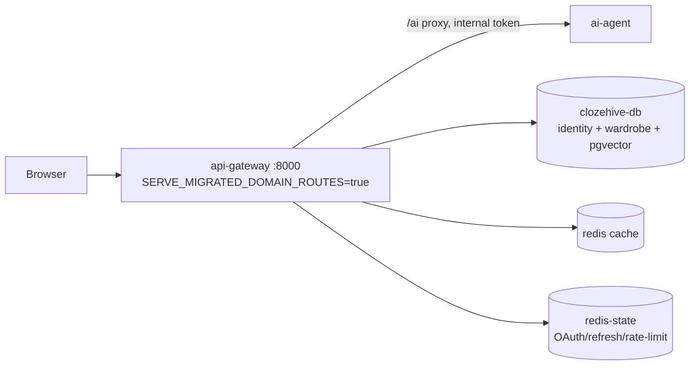
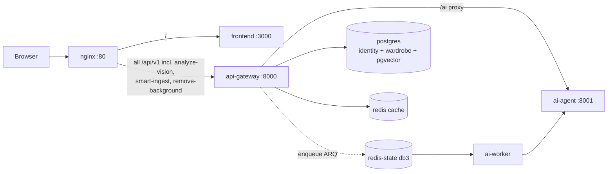
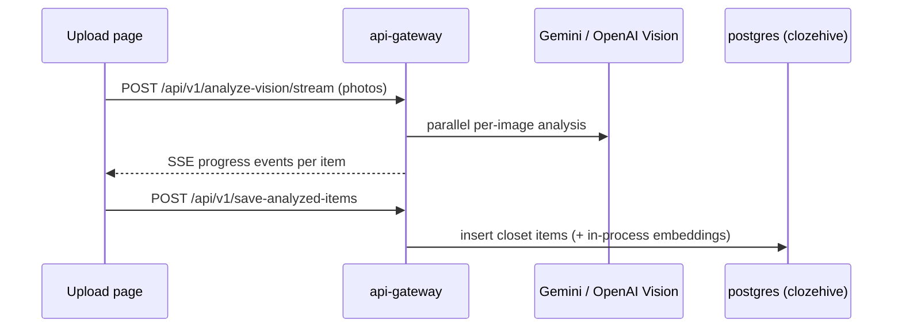
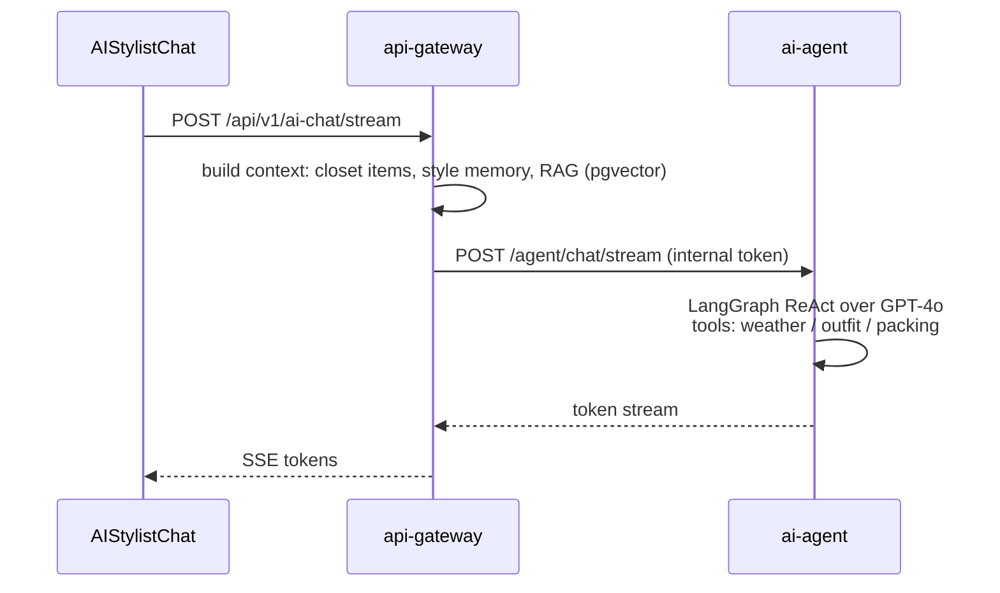
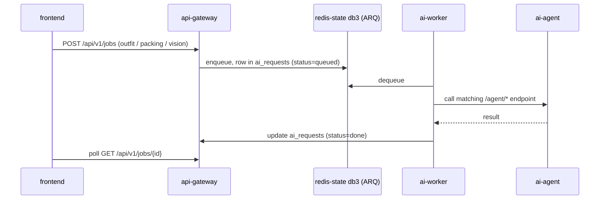

# Clozehive — Services & Workflows

This document covers every service that is **actually wired and running**.
Two topologies exist and are both documented:

- **Production (Render)** — the deployed blueprint (`render.yaml`). No nginx; the
  frontend calls the api-gateway directly. The gateway is the **sole owner of the
  wardrobe domain** and runs the vision pipeline in-process. `ai-worker` is **not**
  deployed there.
- **Local dev (`docker compose up --build`)** — the multi-service stack behind
  nginx (gateway, ai-agent, frontend, and the `ai-worker` job consumer). Vision
  runs in-process inside the gateway, matching production.

Optional/unwired components are listed at the end.

> **History:** there used to be separate `closet-service` (:8003) and
> `vision-service` (:8002) processes — the former owned the wardrobe domain against
> its own Postgres, the latter did image analysis/background removal against
> `postgres-closet`. Both were **retired**: the gateway always carried copies of
> those routers and prod already served them in-process, so the standalone services
> were dormant, drift-prone duplicates. The wardrobe domain and vision pipeline now
> live only in the api-gateway.

---

## 1. System Overview

### Production (Render) — canonical



The frontend's `VITE_API_URL` points at the gateway, which serves the **entire**
`/api/v1` surface — identity, travel/weather, platform, **and** the wardrobe +
intelligence domains (closet, outfits, trips, ai, ai-chat, analytics, rag, …).
Vision ingestion runs **in-process in the gateway** (`smart_ingest` /
`vision_pipeline` routers); embedding generation runs in-process via
BackgroundTasks (`HEAVY_WORK_ASYNC=false`).

### Local dev (`docker compose up`) — full stack



In dev the wardrobe/intelligence routers (including the vision pipeline) mount
automatically (`mount_migrated_routes` defaults on outside production), and nginx
proxies all `/api/v1` prefixes — vision routes included — to the gateway. The dev
stack now mirrors production: there is no separate vision database or vision
process, so the full upload→closet flow runs against one `postgres`.

**Databases:** `postgres` (clozehive) holds **everything the gateway owns** —
identity/auth/platform **and** the wardrobe domain (items, outfits, trips,
embeddings, `ai_requests`, agent vector store). `pgvector/pgvector:pg16` enables
embedding search.

**Two-Redis split:** `redis` (allkeys-lru, evictable) is pure cache;
`redis-state` (noeviction) holds data that must survive memory pressure —
OAuth CSRF/code state, refresh tokens, rate-limit counters, and the ARQ job
queue (db 3).

---

## 2. nginx (reverse proxy, `:80`) — dev stack only

Single public entry point for the local stack (prod on Render has no nginx).
Config: `infra/nginx/nginx.conf`.

Responsibilities:
- **Routing** (most-specific first):
  - `/api/v1/analyze-vision/stream` → api-gateway (in-process vision), SSE mode (no buffering, no read timeout)
  - `/api/v1/(analyze-vision|save-analyzed-items|smart-ingest)` → api-gateway (in-process vision)
  - `/api/v1/closet/{id}/remove-background` → api-gateway (in-process vision)
  - `/api/v1/(ai/*|ai-chat)/(stream|async)` → api-gateway, SSE mode
  - `/api/v1/(closet|outfits|trips|ai|ai-chat|analytics|shopping|rag|fashion-knowledge|purchase-gaps)` → api-gateway (120 s read timeout for long AI generations)
  - `/api/v1/ws` → api-gateway, WebSocket upgrade (24 h timeouts)
  - `/api/` (everything else: auth, profile, weather, admin, jobs, rum) → api-gateway
  - `/uploads/` → api-gateway (garment images)
  - `/assets/` → frontend, cached 1 year immutable; `/` → frontend SPA shell, `no-cache`
- **Rate limiting:** 30 r/s general API, 5 r/s auth, 10 r/s AI endpoints (per IP)
- **Security headers**, gzip, JSON access logs with request IDs
- `/metrics` restricted to private networks only

---

## 3. frontend (React SPA, `:3000` container / `:3001` host)

Vite + React + TypeScript, served by its own nginx inside the container
(proxies `/api` and `/uploads` to the gateway when `VITE_API_URL` is empty). In
production `VITE_API_URL` is the gateway's Render URL.

Pages wired to the backend:

| Page | Backend it talks to |
|---|---|
| Dashboard, Onboarding (incl. Style Profile) | api-gateway |
| Upload | api-gateway (analyze + SSE stream + save, all in-process vision) |
| Closet, ClosetMatch | api-gateway (CRUD, similarity) |
| OutfitBuilder, SavedOutfits | api-gateway |
| AIStylist, AIStylistChat | api-gateway `/ai`, `/ai-chat` (SSE streaming) |
| TravelPlanner | api-gateway (trips, packing, weather) |
| Analytics | api-gateway |
| PurchaseGaps, ShoppingCheck | api-gateway |
| Profile, ForgotPassword/ResetPassword, OAuth callback | api-gateway (identity) |

Observability: Sentry (`@sentry/react`) + web-vitals RUM posted to the
gateway's `/rum` endpoint.

---

## 4. api-gateway (FastAPI, `:8000`) — the wardrobe owner

Owns the **entire `/api/v1` surface**: identity, travel-weather, platform, **the
wardrobe domain, and the intelligence (closet-data AI) domain**, plus the
`/ai/*` proxy to ai-agent and job enqueueing. Database: `postgres` (clozehive;
asyncpg + SQLAlchemy, Alembic migrations via the run-once `migrate` container).

### Always-mounted routers (`app/api/v1/router.py`)

| Domain | Routes | Notes |
|---|---|---|
| **identity** | `/auth/*` (register, login, refresh, Google OAuth callback), `/profile` | JWT (shared `JWT_SECRET`); refresh tokens + OAuth CSRF state in redis-state |
| **travel** | `/weather`, `/trips/*` | Trip CRUD + AI packing; live OpenWeather forecast |
| **platform** | `/health`, `/admin`, `/rum`, `/ws` | `/ws` = notification WebSocket; `/rum` ingests web-vitals |

### Wardrobe + intelligence routers

These mount when `mount_migrated_routes` is true — which is **dev/test by
default, and production via the explicit `SERVE_MIGRATED_DOMAIN_ROUTES=true`
override** in `render.yaml`. They are the live owner of these prefixes (there is
no separate service anymore).

| Area | Routes | What it does |
|---|---|---|
| Closet | `/closet/*` | Item CRUD, image metadata, availability |
| Similarity | `/closet/similarity`, match | pgvector embedding search over closet items |
| Outfits | `/outfits/*` | Outfit CRUD + AI outfit generation |
| Outfit history | wear tracking | Logs/queries what was worn when (feeds RAG) |
| Planner | `/planner/*` | Weekly weather-aware outfit calendar |
| Smart ingest | `/smart-ingest/*` | Bulk ingest sessions (in-process vision) |
| Vision pipeline | `/analyze-vision`, `/save-analyzed-items` | In-process garment analysis + save |
| AI | `/ai/*` (incl. `/stream`, `/async`) | Outfit/packing/stylist generation — calls **ai-agent** |
| AI Chat | `/ai-chat/*` (SSE stream) | Conversational stylist with closet context |
| Jobs | `/jobs/*` | Enqueue/poll async AI jobs (ARQ) |
| Shopping check | `/shopping/*` | In-store "should I buy this?" advisor |
| Purchase gaps | `/purchase-gaps` | Detects wardrobe gaps worth buying |
| RAG | `/rag/*`, `/fashion-knowledge` | Retrieval over fashion knowledge + closet (pgvector) |
| Analytics | `/analytics` | Closet usage stats |
| Internal | `app/api/internal.py` | `GET /internal/users/{id}` seam, guarded by `INTERNAL_SERVICE_TOKEN` |

Important behavior:
- Serves `/uploads/*` garment images (shared `uploads` volume; GCS optional).
- Embedding generation runs **in-process** via FastAPI BackgroundTasks
  (`similarity_service.schedule_embedding_update` → `update_item_embedding_job`).
  `HEAVY_WORK_ASYNC=true` *would* offload it to the ARQ queue, but the durable
  embedding path was retired and `ai-worker` isn't deployed in prod.
- On account deletion the user row CASCADE-deletes their closet data in the same
  DB; a legacy cross-service purge seam exists but is a no-op (`CLOSET_SERVICE_URL`
  unset).
- Observability: Prometheus `/metrics`, optional Sentry + OpenTelemetry.

---

## 5. Vision pipeline (in api-gateway) — retired standalone service

There is no separate `vision-service` process anymore. Image analysis, smart
ingest, and background removal run **in-process inside the api-gateway** via its
wardrobe routers (see §4: *Smart ingest*, *Vision pipeline*). This matches
production, where the standalone service was never deployed.

The routes (`/analyze-vision`, `/analyze-vision/stream`, `/save-analyzed-items`,
`/smart-ingest`, `/closet/{id}/remove-background`) are served by the gateway and
write to the same `postgres` (clozehive) DB the gateway reads from.

Key internals (`app/api/v1/wardrobe/services/`): `vision_pipeline_service`
(parallelized detection + an OOM-guarded `img.draft()` reduced-scale JPEG decode),
`gemini_service` / `fashion_analysis_service` (model calls),
`background_removal_service`, `similarity_service` + `item_vision_enrichment`
(embeddings for closet matching). The CI drift gate
(`scripts/check_service_drift.py`) no longer pins any pairs — the gateway owns the
sole copy.

---

## 6. ai-agent (FastAPI + LangGraph, `:8001`)

The LLM brain. **Not exposed publicly** — reached only service-to-service
(api-gateway, ai-worker) guarded by `INTERNAL_SERVICE_TOKEN`.

- Agent: `create_react_agent` (LangGraph prebuilt ReAct) over `ChatOpenAI`
  (`gpt-4o`).
- Tools run **in-process** (no external MCP servers): `weather`
  (OpenWeather live forecast, falls back to static climate profiles),
  `outfit`, `packing`.
- Supporting services: style memory + pgvector vector store (`postgres`,
  `VECTOR_STORE=pgvector`) for personalization/RAG.
- Optional LangSmith tracing.

Endpoints (`/agent/*`):

| Route | Used by |
|---|---|
| `POST /agent/chat`, `POST /agent/chat/stream` | gateway AI chat (streamed back as SSE) |
| `POST /agent/outfit` | outfit generation |
| `POST /agent/packing` | trip packing lists |
| `POST /agent/vision/analyze` | vision-assist for the worker path |

---

## 7. ai-worker (ARQ worker, no HTTP port) — dev stack only

Durable async job consumer. **Disabled on Render free tier** (workers require a
paid plan; `HEAVY_WORK_ASYNC=false` keeps post-write work in-process). In the
dev stack it listens on the ARQ queue in **redis-state db 3** (matching the
gateway's `ARQ_REDIS_URL`), executes jobs, and writes results to the
`ai_requests` table in `postgres`.

Registered tasks (`app/worker.py`):

| Task | Flow |
|---|---|
| `analyze_image_task` | → ai-agent `/agent/vision/analyze` → result to `ai_requests` |
| `generate_outfit_task` | → ai-agent `/agent/outfit` → result to `ai_requests` |
| `generate_packing_task` | → ai-agent `/agent/packing` → result to `ai_requests` |

(The former `generate_embedding_task` was removed — embeddings run in-process in
the gateway.)

Also runs a queue-depth poll loop and exposes Prometheus metrics on `:9104`
(internal only). Jobs are enqueued by the gateway's `/jobs` endpoints and
polled by the frontend.

---

## 8. Data & infrastructure services

| Service | Image | Role |
|---|---|---|
| `postgres` (host `:5433`) | pgvector/pg16 | Everything the gateway owns: identity, auth, platform, **wardrobe domain** (incl. vision-ingested items), `ai_requests`, agent vector store |
| `redis` (host `:6382`) | redis:7 | Cache — evictable (allkeys-lru). db0 gateway (incl. vision cache), db1 ai-agent |
| `redis-state` (host `:6383`) | redis:7 | **Non-evictable** (noeviction): OAuth state, refresh tokens, rate limits (db0), ARQ queue (db3) |
| `migrate` | run-once | Alembic `upgrade head` against `postgres` on every `compose up` |

---

## 9. Core workflows

### 9.1 Authentication

```mermaid
sequenceDiagram
    participant FE as frontend
    participant GW as api-gateway
    participant RS as redis-state
    FE->>GW: POST /api/v1/auth/login (or Google OAuth)
    GW->>RS: store refresh token / OAuth CSRF state
    GW-->>FE: access JWT + refresh token
    Note over FE: JWT sent on every request; services<br/>validate it locally (shared JWT_SECRET)
```

### 9.2 Garment upload & analysis (production / in-process)



(Bulk path: `smart-ingest` creates a review session — analyze many photos,
user reviews/edits, then commits. This runs identically in dev and prod: all
in-process in the gateway.)

### 9.3 AI stylist chat (streaming)



### 9.4 Trip packing

1. User creates a trip in TravelPlanner → `POST /trips` (api-gateway).
2. Packing generation: gateway → ai-agent `/agent/packing`; the weather tool
   fetches a live OpenWeather forecast for the destination (static climate
   profile fallback when no API key).
3. Packing-memory service stores user preferences to improve future lists.

### 9.5 Async AI jobs (ARQ) — dev stack



In production `ai-worker` isn't deployed and `HEAVY_WORK_ASYNC=false`, so these
run synchronously in-process; the `/jobs` poll API still works for the flows
that use it.

### 9.6 Observability

- **Prometheus**: gateway/agent expose `/metrics` (nginx blocks public access);
  ai-worker exports queue depth and job SLA metrics on `:9104` (dev).
- **Sentry**: frontend + gateway + worker (DSN optional).
- **RUM**: frontend web-vitals → gateway `/api/v1/platform/rum`.
- **LangSmith**: optional LLM tracing for ai-agent (env-gated).
- **WebSocket** (`/api/v1/ws` on the gateway): real-time notification channel.

---

## 10. Not part of the running system (excluded by design)

These exist in the repo but are **not wired** into the default stack:

- **`mcp-vision`** (`services/mcp/vision`) — legacy MCP vision server; only
  starts with `docker compose --profile vision up`. The default stack runs all
  tools in-process inside ai-agent and vision analysis in-process inside the
  api-gateway.
- **Social domain** (`api-gateway/app/api/v1/social`, Groups page) — router is
  commented out (`# Non-MVP: Phase 2`); no backend routes are mounted.
