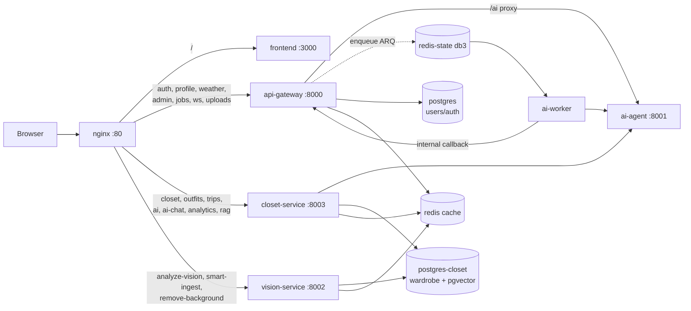
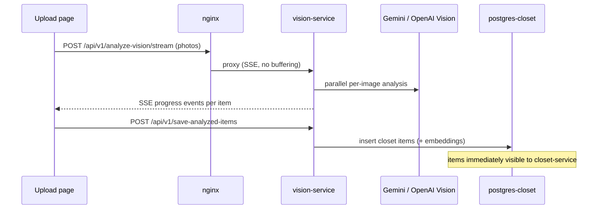
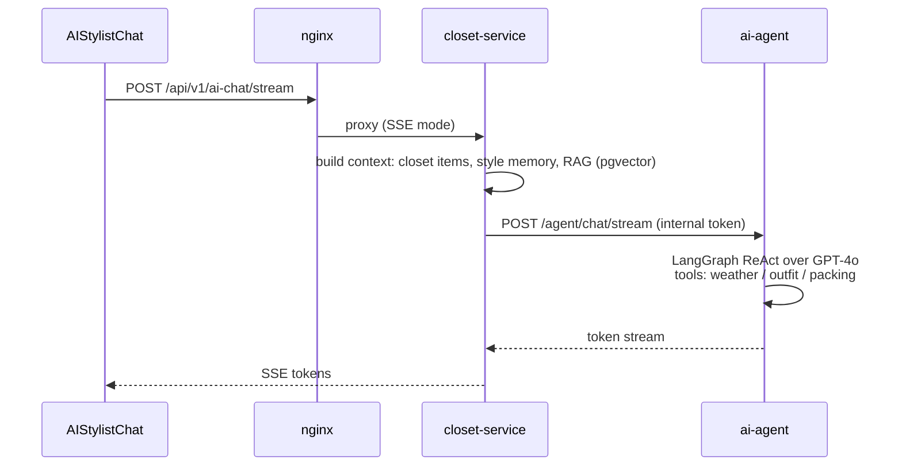
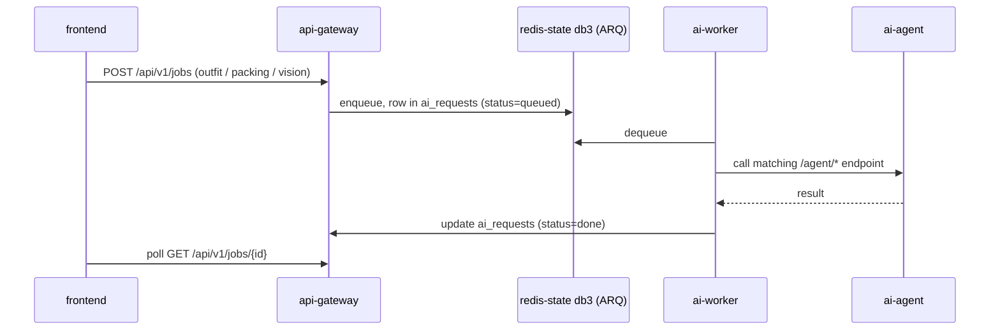

# Clozehive — Services & Workflows

This document covers every service that is **actually wired and running** in the
default stack (`docker compose up --build`). Optional/unwired components are
listed at the end for completeness but are not documented as part of the
running system.

---

## 1. System Overview

```
Browser
  │
  ▼
nginx (:80) ──────────────────────────────────────────────────────────────┐
  │                                                                       │
  ├── /                    → frontend (React SPA, :3000)                  │
  ├── /api/v1/auth, profile, weather, admin, jobs, ws, /uploads          │
  │                        → api-gateway (:8000)                          │
  ├── /api/v1/closet|outfits|trips|ai|ai-chat|analytics|rag|...          │
  │                        → closet-service (:8003)                       │
  └── /api/v1/analyze-vision|smart-ingest|.../remove-background          │
                           → vision-service (:8002)                       │
                                                                          │
api-gateway ── /ai/* proxy ──► ai-agent (:8001, LangGraph + GPT-4o)       │
closet-service ────────────────┘                                          │
                                                                          │
api-gateway / closet-service ── enqueue ARQ job ──► redis-state (db 3)    │
                                          │                               │
                                          ▼                               │
                                     ai-worker ──► ai-agent / gateway     │
```



**Two-database split:** `postgres` holds identity/auth/platform data;
`postgres-closet` holds the wardrobe domain (items, outfits, trips,
embeddings). Both run `pgvector/pgvector:pg16`. There is **no FK** from
closet tables to `users` — cleanup happens through an internal purge seam.

**Two-Redis split:** `redis` (allkeys-lru, evictable) is pure cache;
`redis-state` (noeviction) holds data that must survive memory pressure —
OAuth CSRF/code state, refresh tokens, rate-limit counters, and the ARQ job
queue (db 3).

---

## 2. nginx (reverse proxy, `:80`)

Single public entry point. Config: `infra/nginx/nginx.conf`.

Responsibilities:
- **Routing** (most-specific first):
  - `/api/v1/analyze-vision/stream` → vision-service, SSE mode (no buffering, no read timeout)
  - `/api/v1/(analyze-vision|save-analyzed-items|smart-ingest)` → vision-service
  - `/api/v1/closet/{id}/remove-background` → vision-service
  - `/api/v1/(ai/*|ai-chat)/(stream|async)` → closet-service, SSE mode
  - `/api/v1/(closet|outfits|trips|ai|ai-chat|analytics|shopping|rag|fashion-knowledge|purchase-gaps)` → closet-service (120 s read timeout for long AI generations)
  - `/api/v1/ws` → api-gateway, WebSocket upgrade (24 h timeouts)
  - `/api/` (everything else: auth, profile, weather, admin, jobs, rum) → api-gateway
  - `/uploads/` → api-gateway (garment images)
  - `/assets/` → frontend, cached 1 year immutable; `/` → frontend SPA shell, `no-cache`
- **Rate limiting:** 30 r/s general API, 5 r/s auth, 10 r/s AI endpoints (per IP)
- **Security headers**, gzip, JSON access logs with request IDs
- `/metrics` restricted to private networks only

---

## 3. frontend (React SPA, `:3000` container / `:3001` host)

Vite + React + TypeScript, served by its own nginx inside the container
(proxies `/api` and `/uploads` to the gateway when `VITE_API_URL` is empty).

Pages wired to the backend:

| Page | Backend it talks to |
|---|---|
| Dashboard, Onboarding (incl. Style Profile) | api-gateway, closet-service |
| Upload | vision-service (analyze + SSE stream), closet-service (save) |
| Closet, ClosetMatch | closet-service (CRUD, similarity) |
| OutfitBuilder, SavedOutfits | closet-service |
| AIStylist, AIStylistChat | closet-service `/ai`, `/ai-chat` (SSE streaming) |
| TravelPlanner | closet-service (trips, packing), api-gateway (weather) |
| Analytics | closet-service |
| PurchaseGaps, ShoppingCheck | closet-service |
| Profile, ForgotPassword/ResetPassword, OAuth callback | api-gateway (identity) |

Observability: Sentry (`@sentry/react`) + web-vitals RUM posted to the
gateway's `/rum` endpoint.

---

## 4. api-gateway (FastAPI, `:8000`)

Owns **identity, travel-weather, and platform** domains, plus the `/ai/*`
proxy to ai-agent and job enqueueing. Database: `postgres` (asyncpg +
SQLAlchemy, Alembic migrations via the run-once `migrate` container).

Mounted routers (`app/api/v1/router.py`):

| Domain | Routes | Notes |
|---|---|---|
| **identity** | `/auth/*` (register, login, refresh, Google OAuth callback), `/profile` | JWT (shared `JWT_SECRET` across services); refresh tokens + OAuth CSRF state in redis-state |
| **travel** | `/weather` | Trip CRUD itself migrated to closet-service |
| **platform** | `/health`, `/admin`, `/rum`, `/ws` | `/ws` = real-time notification WebSocket; `/rum` ingests frontend web-vitals |
| **intelligence (jobs)** | `/jobs/*` | Enqueue/poll async AI jobs (ARQ) |

Important behavior:
- The wardrobe and intelligence routers still exist in the gateway codebase
  but are mounted **only when `mount_migrated_routes` is true (dev/test)** —
  in production closet-service is the sole owner of those prefixes.
- Serves `/uploads/*` garment images (shared `uploads` volume; GCS optional).
- `HEAVY_WORK_ASYNC=true` offloads embedding generation to the ARQ queue
  (ai-worker); default `false` runs it in-process via BackgroundTasks.
- Observability: Prometheus `/metrics`, optional Sentry + OpenTelemetry.

---

## 5. closet-service (FastAPI, `:8003`)

Owns the **wardrobe domain and all closet-data AI features**. Authenticates
by validating the gateway-issued JWT **locally** (shared `JWT_SECRET`) — no
per-request call back to the gateway. Database: `postgres-closet`
(own Alembic migrations via `migrate-closet`).

Mounted routers (`app/api/v1/router.py`):

| Area | Routes | What it does |
|---|---|---|
| Closet | `/closet/*` | Item CRUD, image metadata |
| Similarity | `/closet/similarity`, match | pgvector embedding search over closet items |
| Outfits | `/outfits/*` | Outfit CRUD + AI outfit generation |
| Outfit history | wear tracking | Logs/queries what was worn when |
| Trips | `/trips/*` | Trip CRUD + AI packing lists |
| Packing memory | trip-prefixed | Remembers packing preferences per user |
| AI | `/ai/*` (incl. `/stream`, `/async`) | Outfit/packing/stylist generation — calls **ai-agent** |
| AI Chat | `/ai-chat/*` (SSE stream) | Conversational AI stylist with closet context |
| Shopping check | `/shopping/*` | In-store "should I buy this?" advisor |
| Purchase gaps | `/purchase-gaps` | Detects wardrobe gaps worth buying |
| RAG | `/rag/*`, `/fashion-knowledge` | Unified retrieval over fashion knowledge + closet (pgvector) |
| Analytics | `/analytics` | Closet usage stats |
| Trends | admin trend ingestion | Admin-only fashion-trend ingestion |
| Internal | `app/api/internal.py` | Internal seam (e.g. user purge) guarded by `INTERNAL_SERVICE_TOKEN` |

---

## 6. vision-service (FastAPI, `:8002`)

Image analysis and background removal. Writes analyzed items **directly into
`postgres-closet`** so saved items are immediately visible to closet-service.

Endpoints (`app/api/v1/`):

| Route | What it does |
|---|---|
| `POST /analyze-vision` | Batch garment analysis (Gemini / OpenAI vision) |
| `POST /analyze-vision/stream` | SSE — per-image progress streamed to the Upload page |
| `POST /save-analyzed-items` | Persist analyzed items to the closet DB |
| `POST /smart-ingest` + GET/PATCH/DELETE | Bulk ingest sessions: analyze many photos, review, then commit |
| `POST /closet/{id}/remove-background` | Per-item background removal |

Key internals: `vision_pipeline_service` (parallelized detection),
`gemini_service` / `fashion_analysis_service` (model calls),
`background_removal_service`, `similarity_service` + `item_vision_enrichment`
(embeddings for closet matching), Redis db 2 for caching, JWT validated
locally.

---

## 7. ai-agent (FastAPI + LangGraph, `:8001`)

The LLM brain. **Not exposed through nginx** — reached only service-to-service
(api-gateway, closet-service, ai-worker) on the Docker network, guarded by
`INTERNAL_SERVICE_TOKEN`.

- Agent: `create_react_agent` (LangGraph prebuilt ReAct) over `ChatOpenAI`
  (`gpt-4o`).
- Tools run **in-process** (no external MCP servers): `weather`
  (OpenWeather live forecast, falls back to static climate profiles),
  `outfit`, `packing`.
- Supporting services: style memory + pgvector vector store (`postgres`,
  `VECTOR_STORE=pgvector`) for personalization/RAG.
- Optional LangSmith tracing.

Endpoints (`/agent/*`):

| Route | Used by |
|---|---|
| `POST /agent/chat`, `POST /agent/chat/stream` | closet-service AI chat (streamed back as SSE) |
| `POST /agent/outfit` | outfit generation |
| `POST /agent/packing` | trip packing lists |
| `POST /agent/vision/analyze` | vision-assist for the worker path |

---

## 8. ai-worker (ARQ worker, no HTTP port)

Durable async job consumer. Listens on the ARQ queue in **redis-state db 3**
(matching the gateway's `ARQ_REDIS_URL`), executes jobs, and writes results
to the `ai_requests` table in `postgres`.

Registered tasks (`app/worker.py`):

| Task | Flow |
|---|---|
| `analyze_image_task` | → ai-agent `/agent/vision/analyze` → result to `ai_requests` |
| `generate_outfit_task` | → ai-agent `/agent/outfit` → result to `ai_requests` |
| `generate_packing_task` | → ai-agent `/agent/packing` → result to `ai_requests` |
| `generate_embedding_task` | → calls **back into the gateway** (`GATEWAY_INTERNAL_URL` + internal token) to embed a closet item — the `HEAVY_WORK_ASYNC` path |

Also runs a queue-depth poll loop and exposes Prometheus metrics on `:9104`
(internal only). Jobs are enqueued by the gateway's `/jobs` endpoints and
polled by the frontend.

---

## 9. Data & infrastructure services

| Service | Image | Role |
|---|---|---|
| `postgres` (host `:5433`) | pgvector/pg16 | Identity, auth, platform, `ai_requests`, agent vector store |
| `postgres-closet` (host `:5434`) | pgvector/pg16 | Wardrobe domain: items, outfits, trips, embeddings |
| `redis` (host `:6382`) | redis:7 | Cache — evictable (allkeys-lru). db0 gateway, db1 ai-agent, db2 vision, db4 closet-service |
| `redis-state` (host `:6383`) | redis:7 | **Non-evictable** (noeviction): OAuth state, refresh tokens, rate limits (db0), ARQ queue (db3) |
| `migrate` / `migrate-closet` | run-once | Alembic `upgrade head` against each DB on every `compose up` |

---

## 10. Core workflows

### 10.1 Authentication

```mermaid
sequenceDiagram
    participant FE as frontend
    participant N as nginx
    participant GW as api-gateway
    participant RS as redis-state
    FE->>N: POST /api/v1/auth/login (or Google OAuth)
    N->>GW: proxy (5 r/s auth limit)
    GW->>RS: store refresh token / OAuth CSRF state
    GW-->>FE: access JWT + refresh token
    Note over FE: JWT sent on every request;<br/>closet- & vision-service validate it locally<br/>(shared JWT_SECRET) — no gateway round-trip
```

### 10.2 Garment upload & analysis



(Bulk path: `smart-ingest` creates a review session — analyze many photos,
user reviews/edits, then commits.)

### 10.3 AI stylist chat (streaming)



### 10.4 Trip packing

1. User creates a trip in TravelPlanner → `POST /trips` (closet-service).
2. Packing generation: closet-service → ai-agent `/agent/packing`; the
   weather tool fetches a live OpenWeather forecast for the destination
   (static climate profile fallback when no API key).
3. Packing-memory service stores user preferences to improve future lists.

### 10.5 Async AI jobs (ARQ)



Embedding offload variant: with `HEAVY_WORK_ASYNC=true`, closet-item
embedding generation is enqueued the same way and `generate_embedding_task`
calls back into the gateway's internal embedding endpoint.

### 10.6 Observability

- **Prometheus**: gateway/agent/worker expose `/metrics` (nginx blocks public
  access); ai-worker exports queue depth and job SLA metrics on `:9104`.
- **Sentry**: frontend + gateway + worker (DSN optional).
- **RUM**: frontend web-vitals → gateway `/api/v1/platform/rum`.
- **LangSmith**: optional LLM tracing for ai-agent (env-gated).
- **WebSocket** (`/api/v1/ws` on the gateway): real-time notification channel.

---

## 11. Not part of the running system (excluded by design)

These exist in the repo but are **not wired** into the default stack and are
intentionally not documented above:

- **`mcp-vision`** (`services/mcp/vision`) — legacy MCP vision server; only
  starts with `docker compose --profile vision up`. The default stack runs all
  tools in-process inside ai-agent and analysis inside vision-service.
- **Social domain** (`api-gateway/app/api/v1/social`, Groups page) — router is
  commented out (`# Non-MVP: Phase 2`); no backend routes are mounted.
- **Gateway copies of wardrobe/intelligence routers** — mounted only in
  dev/test (`mount_migrated_routes`); in production closet-service owns those
  prefixes exclusively.
